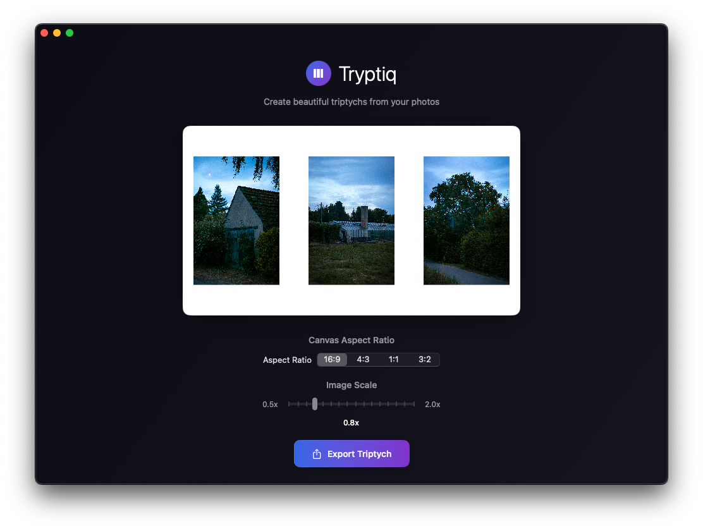

#  Tryptiq

> **Create stunning photo triptychs with elegant simplicity**

Tryptiq is a beautiful, modern macOS application designed for photographers, artists, and creative professionals who want to create compelling three-panel compositions from their photos. With its intuitive drag-and-drop interface and powerful export capabilities, Tryptiq makes it effortless to transform your individual images into cohesive artistic statements.



*Create stunning three-panel compositions with Tryptiq's intuitive interface*

## ✨ Features

### 🎨 **Intuitive Creation**
- **Drag & Drop Interface**: Simply drag photos from Finder into the three image slots
- **Real-time Preview**: See your triptych composition update instantly as you work
- **Smart Rearranging**: Drag images between slots to reorder your composition
- **Responsive Canvas**: Automatically adapts to your screen size and window dimensions

### 📐 **Flexible Layout Control**
- **Multiple Aspect Ratios**: Choose from 16:9, 4:3, 1:1, or 3:2 canvas proportions
- **Precision Scaling**: Fine-tune image size with smooth 0.5x to 2.0x scaling
- **Adaptive Sizing**: Canvas intelligently adjusts to accommodate your images

### 🚀 **Professional Export**
- **High-Quality Output**: Adaptive resolution based on your source images
- **Smart Resolution**: Automatically scales to preserve image quality (minimum 1200px)
- **PNG Export**: Clean, lossless output perfect for printing or digital display
- **Instant Save**: One-click export with system file picker

### 🎭 **Beautiful Design**
- **Dark Mode**: Elegant dark interface that lets your photos shine
- **Gradient Aesthetics**: Smooth blue-to-purple gradients throughout the UI
- **Custom Icon**: Hand-crafted app icon reflecting the triptych concept
- **Smooth Animations**: Subtle, polished transitions and interactions

## 🖥️ System Requirements

- **macOS**: 14.0 (Sonoma) or later
- **Architecture**: Apple Silicon (M1/M2/M3) or Intel
- **Memory**: 4GB RAM recommended
- **Storage**: 50MB for application

## 📥 Installation

### Option 1: Download Release (Recommended)
1. Download the latest `Tryptiq.dmg` from [Releases](releases/)
2. Double-click to mount the disk image
3. Drag Tryptiq to your Applications folder
4. Launch from Applications or Spotlight

### Option 2: Build from Source
```bash
git clone https://github.com/yourname/tryptiq.git
cd tryptiq
open Tryptiq.xcodeproj
# Build and run in Xcode (⌘+R)
```

## 🎯 Quick Start Guide

1. **Launch Tryptiq** - Open the app from your Applications folder
2. **Choose Canvas Format** - Select your preferred aspect ratio (16:9, 4:3, 1:1, 3:2)
3. **Add Images** - Drag photos from Finder into the Left, Center, and Right panels
4. **Arrange & Scale** - Drag images between slots to reorder; use the slider to resize
5. **Export** - Click "Export Triptych" and choose where to save your creation

> 💡 **Pro Tip**: For best results, use high-resolution source images. Tryptiq will automatically optimize the output resolution based on your largest image.

## 🔧 Advanced Features

### Image Rearranging
- **Drag Between Slots**: Click and drag any image to a different position
- **Visual Feedback**: Hover effects show where images will be placed
- **Swap Function**: Images automatically swap positions when dragged

### Export Options
- **Adaptive Resolution**: Output size scales with your source images
- **Quality Preservation**: Maintains aspect ratios and prevents upscaling artifacts
- **File Naming**: Exports with "triptych_" prefix and timestamp for organization

### Supported Formats
**Input**: JPEG, PNG, TIFF, GIF, BMP, HEIC, WebP, RAW formats  
**Output**: High-quality PNG files

## 📚 Documentation

For detailed guides and technical information, see our [Documentation](docs/):

- [User Guide](docs/user-guide.md) - Complete step-by-step instructions
- [Technical Documentation](docs/technical.md) - Developer information and architecture
- [Release Notes](docs/releases.md) - Version history and changes

## 🏗️ Project Structure

```
Tryptiq/
├── Tryptiq.xcodeproj/          # Xcode project configuration
├── Tryptiq/                    # Source code
│   ├── TryptiqApp.swift        # App entry point and window configuration
│   ├── ContentView.swift       # Root view wrapper
│   ├── TriptychView.swift      # Main interface with image slots and controls
│   ├── ImageSlot.swift         # Individual draggable image containers
│   ├── TryptiqLogo.swift       # Custom app icon and branding
│   ├── Assets.xcassets/        # App icons, colors, and assets
│   ├── Preview Content/        # SwiftUI preview assets
│   ├── Tryptiq.entitlements   # App sandbox permissions
│   └── Info.plist             # App metadata and configuration
├── docs/                       # Documentation and guides
└── README.md                   # This file
```

## 🛠️ Technical Architecture

Tryptiq is built with modern Apple technologies for optimal performance and native macOS integration:

- **SwiftUI**: Declarative UI framework for smooth, responsive interface
- **Combine**: Reactive programming for state management
- **Core Graphics**: High-performance image processing and rendering
- **AppKit Integration**: Native file dialogs and system services
- **App Sandboxing**: Secure, permission-based file access

### Key Components

- **TriptychView**: Main interface coordinating image slots and export functionality
- **ImageSlot**: Reusable component handling drag-drop, scaling, and visual feedback  
- **ImageDropDelegate**: Custom drop handling for internal rearranging vs external drops
- **Adaptive Layout**: GeometryReader-based responsive design system

## 🤝 Contributing

Interested in contributing? We welcome:

- **Bug Reports**: Found an issue? [Open an issue](issues/new)
- **Feature Requests**: Have an idea? [Start a discussion](discussions/)
- **Code Contributions**: See our [Contributing Guide](docs/contributing.md)
- **Documentation**: Help improve our guides and examples

## 📄 License

This project is licensed under the MIT License - see the [LICENSE](LICENSE) file for details.

## 🙏 Acknowledgments

- Inspired by the artistic tradition of triptych art
- Built with love for the macOS creative community
- Thanks to all beta testers and contributors

---

**Made with ❤️ for macOS creators**

[Website](https://your-website.com) • [Support](mailto:support@your-email.com) • [Twitter](https://twitter.com/yourhandle) 